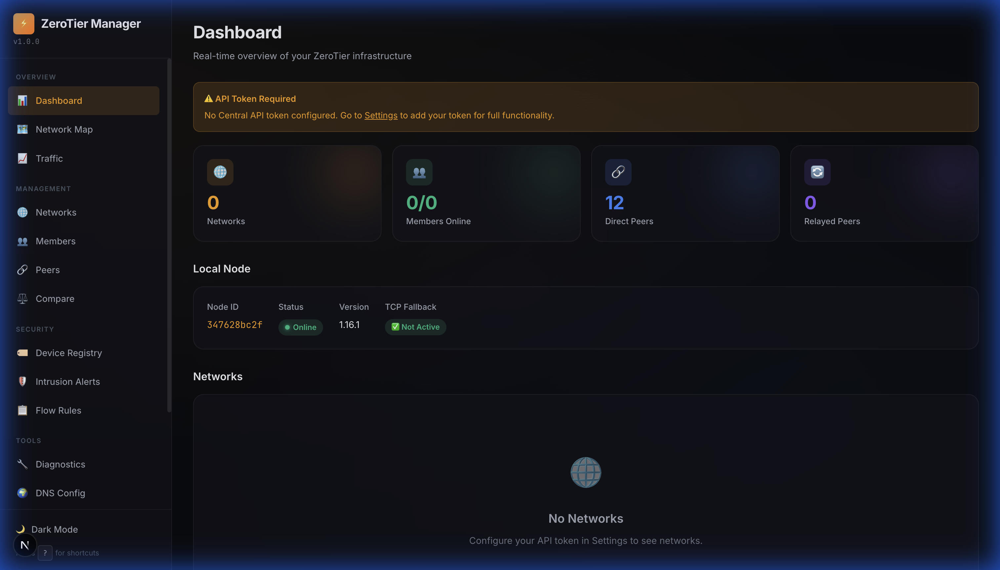
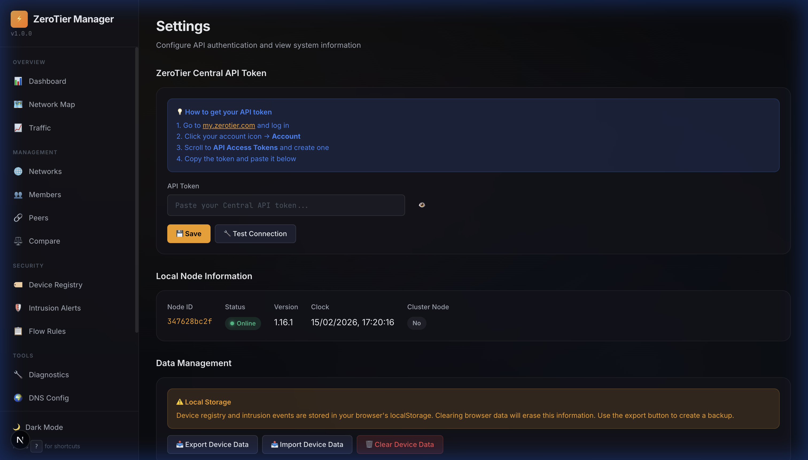
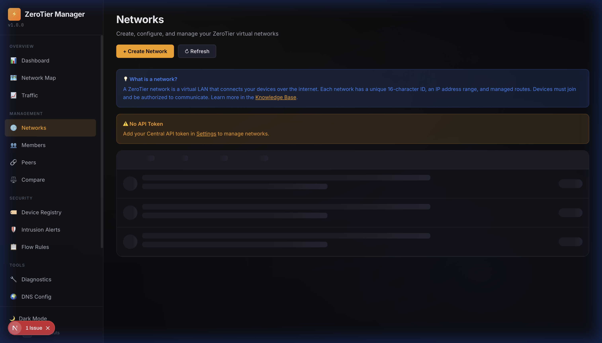

# ⚡ ZeroTier Network Manager

A modern, full-featured web dashboard for managing ZeroTier networks, peers, and devices — built with **Next.js 15**, **TypeScript**, and a sleek glassmorphism dark theme.



## ✨ Features

### 🖥️ Dashboard & Monitoring
- **Real-time overview** of networks, members, peers, and connection status
- **Local node info** — Node ID, version, online status, TCP fallback
- **Network Map** — interactive topology of connected peers
- **Traffic Monitor** — live bandwidth statistics
- **Peer Latency History** — per-peer latency charts stored in localStorage

### 🌐 Network Management
- **Create / Delete networks** via the ZeroTier Central API
- **Network Compare** — side-by-side diff of two network configurations
- **Members Management** — authorize, deauthorize, rename, and manage IP assignments
- **Flow Rules Editor** — syntax-highlighted ZeroTier flow rules

### 🔒 Security
- **Device Registry** — tag, nickname, and track known devices
- **Intrusion Detection** — automatic alerts for new devices, unauthorized joins, IP changes, and version changes
- **Intrusion Alerts** — filterable timeline with severity levels and acknowledgment

### 🛠️ Tools
- **Diagnostics** — network connectivity testing and system health checks
- **DNS Configuration** — manage ZeroTier DNS push records
- **Knowledge Base** — self-managed docs and network troubleshooting guides

### 🎨 UI / UX
- **Dark / Light theme** toggle, persisted in localStorage
- **Toast notifications** — success, error, warning, info with auto-dismiss
- **Skeleton loaders** — polished loading states across all pages
- **Keyboard shortcuts** — `G+D` Dashboard, `G+N` Networks, `?` help modal
- **Mobile responsive** — hamburger sidebar menu on narrow screens
- **Audit Log** — searchable timeline of all admin actions with export

### 🤖 MCP Server
Built-in [Model Context Protocol](https://modelcontextprotocol.io) server for AI assistants:
- `list_networks` / `get_network` / `create_network` / `delete_network`
- `get_members` / `authorize_member` / `deauthorize_member`
- `get_peers` / `get_status`

---

## 📸 Screenshots

| Dashboard | Settings | Networks |
|-----------|----------|----------|
|  |  |  |

---

## 🚀 Quick Start

### Prerequisites
- **Node.js** ≥ 18
- **ZeroTier** installed and running locally ([download](https://www.zerotier.com/download/))
- **API Token** from [my.zerotier.com](https://my.zerotier.com) (Account → API Access Tokens)

### Install & Run

```bash
git clone https://github.com/YOUR_USERNAME/zerotier.git
cd zerotier
npm install
npm run dev
```

Open [http://localhost:3000](http://localhost:3000) and paste your API token in **Settings**.

### Build for Production

```bash
npm run build
npm start
```

---

## 🧪 Testing

```bash
# Run all unit tests
npm test

# Run with coverage
npx jest --coverage
```

**32 tests** across 3 suites covering:
- `lib/audit-log.ts` — action logging, rolling buffer, export
- `lib/latency-store.ts` — sample recording, stats computation, peer limits
- `lib/device-registry.ts` — device CRUD, tagging, intrusion detection

### CI / CD

GitHub Actions runs automatically on every push and PR to `main`:

```yaml
# .github/workflows/ci.yml
- ✅ Unit tests (Jest)
- ✅ Type checking (tsc --noEmit)
- ✅ Production build (next build)
```

[](https://github.com/YOUR_USERNAME/zerotier/actions)

---

## 🗂️ Project Structure

```
zerotier/
├── app/                        # Next.js App Router pages
│   ├── page.tsx                # Dashboard
│   ├── networks/page.tsx       # Network management
│   ├── members/page.tsx        # Member management
│   ├── peers/page.tsx          # Peer connections
│   ├── devices/page.tsx        # Device registry
│   ├── alerts/page.tsx         # Intrusion alerts
│   ├── rules/page.tsx          # Flow rules editor
│   ├── dns/page.tsx            # DNS configuration
│   ├── compare/page.tsx        # Network comparison
│   ├── audit/page.tsx          # Audit log
│   ├── settings/page.tsx       # API token & data management
│   ├── map/page.tsx            # Network topology map
│   ├── traffic/page.tsx        # Traffic monitor
│   ├── diagnostics/page.tsx    # Health checks
│   └── knowledge/page.tsx      # Knowledge base
├── components/
│   ├── Sidebar.tsx             # Navigation sidebar
│   ├── Toast.tsx               # Toast notification system
│   ├── ThemeProvider.tsx        # Dark/light theme context
│   ├── Skeleton.tsx            # Loading skeleton components
│   └── Providers.tsx           # Root providers wrapper
├── lib/
│   ├── api-client.ts           # ZeroTier Central & Service API
│   ├── audit-log.ts            # Audit logging system
│   ├── latency-store.ts        # Peer latency history
│   ├── device-registry.ts      # Device tracking & intrusion detection
│   └── keyboard.ts             # Keyboard shortcut hook
├── server/
│   └── mcp-server.ts           # MCP server for AI assistants
├── __tests__/                  # Unit tests
│   ├── audit-log.test.ts
│   ├── latency-store.test.ts
│   └── device-registry.test.ts
├── .github/workflows/ci.yml    # GitHub Actions CI
└── docs/                       # Screenshots
```

---

## 🔌 MCP Configuration

To connect an AI assistant (like Claude, Cursor, Gemini):

```json
{
  "mcpServers": {
    "zerotier": {
      "command": "npx",
      "args": ["tsx", "server/mcp-server.ts"],
      "env": {
        "ZEROTIER_CENTRAL_TOKEN": "your-api-token",
        "ZEROTIER_SERVICE_URL": "http://localhost:9993"
      }
    }
  }
}
```

---

## 🛡️ Tech Stack

| Layer | Technology |
|-------|-----------|
| Framework | Next.js 15 (App Router, Turbopack) |
| Language | TypeScript |
| Styling | CSS (glassmorphism dark theme) |
| State | React hooks + localStorage |
| API | ZeroTier Central API + Local Service API |
| AI Integration | Model Context Protocol (MCP) |
| Testing | Jest + ts-jest + jsdom |
| CI/CD | GitHub Actions |

---

## 📄 License

MIT — use freely for personal or commercial projects.
